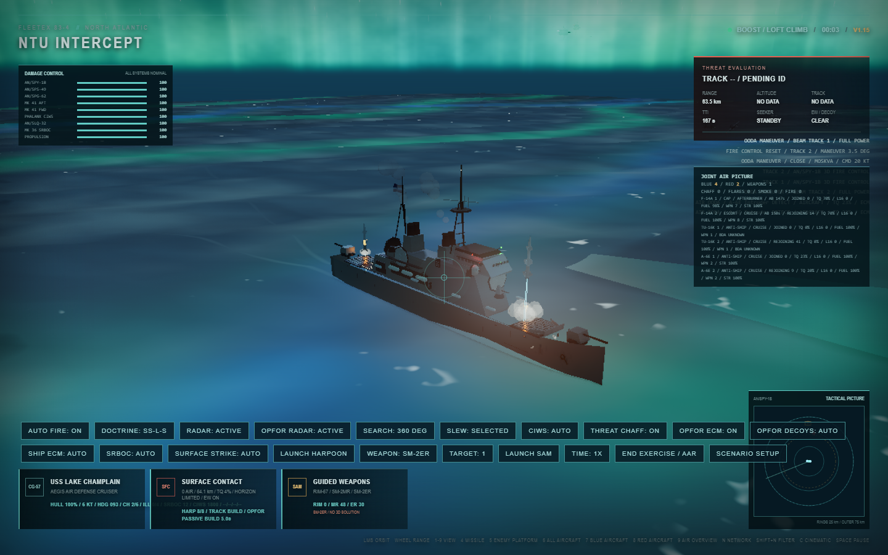
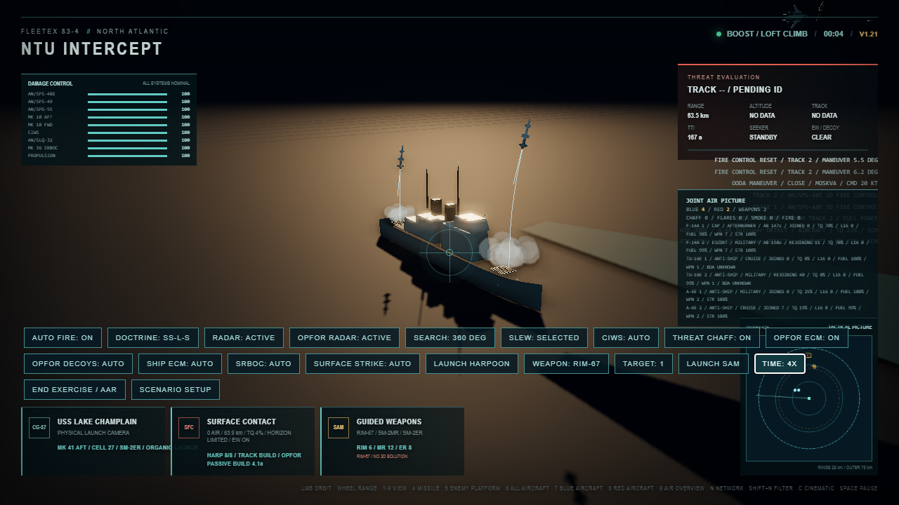

# NTU Intercept

**A 3D Cold War naval and joint-air combat sandbox.** The observable chain runs from radar measurements, track quality, datalinks, and fire-control authorization through physical launchers, phased guidance, electronic warfare, damage, and AAR.

> Documentation snapshot: v1.0.0 · 2026-07-26<br>
> This page describes the v1.0.0 implementation; later versions may change mechanisms, visuals, and unit data.

## Live Demo

### [▶ Run NTU Intercept](https://cwi.kisara.info)

No installation is required. Desktop Edge or Chrome is recommended. Initial asset and shader compilation may take several seconds. Use High quality on limited hardware; WebGPU Ultra, compute clouds, and the FFT ocean are experimental high-load features.

[中文](README.md) · [English Wiki](wiki/en/README.md) · [Chinese Wiki](wiki/README.md) · [v1.0.0 Release](https://github.com/Sekai6/game-coldwar-intercept/releases/tag/v1.0.0)



*USS Lake Champlain (CG-57) combat validation under the WebGPU Ultra aurora environment. This is project evidence, not real-world performance data.*

NTU Intercept is a Cold War naval and joint-air combat sandbox built with TypeScript, Three.js, and Vite. Real platform, radar, and weapon names establish the historical setting; all performance values are game-scaled and must not be treated as engineering, training, or real-world capability data.

### What to watch in the demo

1. Wait for search radar to build uncertain incoming tracks and watch quality, age, and uncertainty change.
2. Enable `NAVAL FORCE` to observe shared cues while each ship still requires its own fire-control authorization.
3. Use number keys, `L`, and `C` to follow ships, aircraft, missiles, the firing ship, and cinematic views; verify physical Mk 10/Mk 41 departure.
4. End the exercise to inspect the AAR timeline, object tracks, launch ownership, and optional Tacview ACMI export.

## Why it is different

The project does not treat “inside a range circle” as a launch or a hit. A target is first measured with sensor error, track age, horizon and electronic-warfare effects; fire control then decides whether the observation is weapon-quality; the owning ship finally performs a real launcher transaction. A mission assignment, HUD label, or export record cannot substitute for that chain.

Its three main strengths are observable sensor uncertainty, non-bypassable per-ship launch ownership, and an AAR/Tacview timeline that lets you audit who actually fired from which launcher. Start with the [Wiki](wiki/README.md), especially [fleet air defense](wiki/MECHANICS/FLEET_AAW.md) and the [joint-air scenario](wiki/SCENARIOS/JOINT_AIR.md).

[Simulation manual](docs/zh/SIMULATION.md) | [Architecture](ARCHITECTURE.md) | [Operations](docs/zh/OPERATIONS.md) | [Verification](docs/zh/VERIFICATION.md) | [English Wiki](wiki/en/README.md)

## Validation Evidence



*Multi-ship physical-launch verification: a companion ship must use its own track, magazine, launcher cell, and departure cycle; neither the flagship nor the fleet coordinator may spawn its missile.*

## Current Capabilities

| Status | Capability |
|---|---|
| **Stable** | Core simulation loop, radar tracks, shipboard AAW, physical launchers, ECM/decoys, AAR, and ACMI |
| **Optional** | Multi-ship force, joint-air combat, AEW/GCI, Link 11, and era-gated Link 16 |
| **Experimental** | WebGPU Ultra, compute volumetric clouds, FFT ocean, compute particles, and temporal reconstruction |

- Independent ship entities: USS Long Beach (CGN-9), USS Lake Champlain (CG-57), and Moskva.
- Independent air entities: F-14A, A-6E, Tu-16K, MiG-29A, E-2C, and Tu-126.
- Three-dimensional ship, aircraft, missile, and decoy motion.
- Radar horizon, RCS range scaling, scan intervals, measurement error, track aging, and weapon-quality authorization.
- NTU-era Link 11, optional later Link 16 era settings, and separate Soviet C2 models.
- ECM, burn-through, chaff, flares, SRBOC, CIWS, and system-level damage.
- Multi-ship formations with independent magazines, sensors, launchers, and damage state.
- Advanced flight AI, aerodynamic envelopes, throttle regimes, fuel, and damage management.
- WebGL high-quality rendering and an experimental WebGPU Ultra path.
- After Action Review and Tacview ACMI export.

## Telemetry and Analysis

The project exposes **428 runtime diagnostic fields** plus fixed-step AAR snapshots, seven event categories, Link 11/16 delivery diagnostics, fleet/C2 observations, and Tacview objects. These support monitoring, regression verification, track/energy analysis, and external plotting. See [Telemetry and analysis](docs/zh/TELEMETRY.md) and the [English telemetry overview](wiki/en/MECHANICS/TELEMETRY.md).

## Simulation Invariants

1. Weapons use observed tracks until their own seekers acquire; they do not read target truth directly.
2. Link 11/16 cues do not automatically grant shipboard weapon authority.
3. Fleet coordinators assign tasks but cannot consume ammunition or spawn weapons.
4. Shipboard SAMs must pass through the firing ship's track, fire control, magazine, channels, and Mk 10/Mk 41 state machine.
5. `weapons-away`, AAR, and ACMI launch records are created only after physical departure.
6. Every ship, aircraft, missile, and decoy is an independently owned entity.

## Quick Start

Node.js 20.19+ or 22.12+ is required.

```bash
npm install
npm run dev
```

Open `http://127.0.0.1:5173/`.

Production build:

```bash
npm run build
```

## Documentation Map

| Topic | Document |
|---|---|
| Run the demo and learn controls, cameras, AAR, and Tacview | [Live demo](https://cwi.kisara.info) · [Operations guide](docs/zh/OPERATIONS.md) |
| Understand sensors, guidance, EW, flight, and damage | [English mechanics Wiki](wiki/en/MECHANICS/README.md) · [Simulation manual](docs/zh/SIMULATION.md) |
| Inspect platforms and missile parameters | [Platform catalog](wiki/en/PLATFORMS/README.md) · [Missile parameter catalog](wiki/en/WEAPONS/MISSILE_PARAMETERS.md) |
| Study telemetry, AAR, and data analysis | [English telemetry overview](wiki/en/MECHANICS/TELEMETRY.md) · [Detailed inventory](docs/zh/TELEMETRY.md) |
| Extend platforms and understand ownership boundaries | [Architecture](ARCHITECTURE.md) · [Architecture guide](docs/zh/ARCHITECTURE.md) |
| Run regression tests or prepare a release | [Verification guide](docs/zh/VERIFICATION.md) · [CHANGELOG](CHANGELOG.md) |
| WebGPU Ultra implementation status | [WebGPU Ultra](docs/WEBGPU_ULTRA.md) |

The complete English Wiki mirrors all current Chinese Wiki paths. Some source-level operator and verification manuals remain Chinese-first; the English Wiki provides the maintained English mechanism, platform, weapon, and scenario reference.

## Source Map

```text
src/air/          air platforms, flight, AI, sensors, weapons, and AEW
src/fleet/        force runtime, formations, Link 11, command, and tasking
src/ships/        independent ship execution, EW, CIWS, and damage control
src/ship-defense/ shared ship-defense target, engagement, launcher, and visual runtimes
src/datalink/     Link 11/16 protocols, era configuration, and observability
src/soviet-c2/    Soviet GCI, maritime targeting, and salvo coordination
src/threats/      incoming-weapon catalog and models
src/scenarios/    scenario-owned initial state and settings
src/aar/          AAR and ACMI recording/export
src/visual/       ocean, atmosphere, clouds, lighting, and WebGPU experiments
src/models/       procedural ship, aircraft, and weapon models
src/main.ts       composition root, frame scheduling, UI, and compatibility bridges
scripts/          logic, browser, screenshot, and regression verification
```

## Project Status

The repository is released as `v1.0.0`. Feature boundaries and verification evidence are listed in [CHANGELOG.md](CHANGELOG.md).

## License

Licensed under the [PolyForm Noncommercial License 1.0.0](LICENSE). Learning, research, and noncommercial use are allowed; commercial use requires separate permission.
