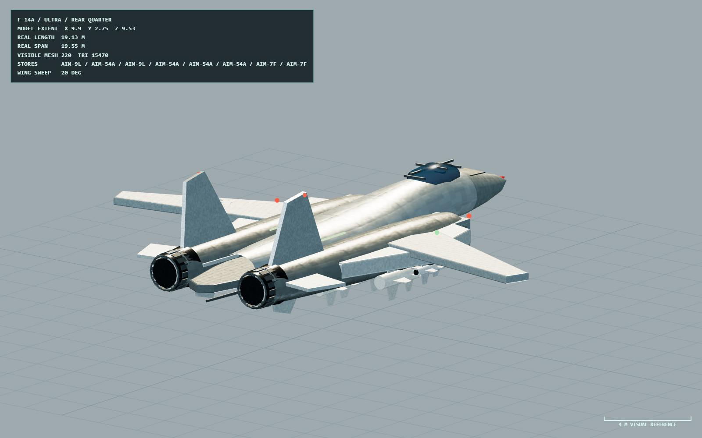

# F-14A Tomcat

> Data snapshot: v1.15.0 · 2026-07-29

双机 CAP/截击平台。可携带 AIM-54A、AIM-7F 和 AIM-9L，拥有三维飞行、编队、雷达航迹、加力和导弹告警机动。目录入口：`src/air/catalog.ts`；模型截图见下方 Ultra 资产验收视图。

## v1.15.0 Ultra 模型截图

*v1.15.0 Ultra 资产验收视图：展示 20°后掠翼、双垂尾、进气道、固定翼套挂架、机腹挂板与完整空战挂载。*

## v1.15.0 程序化模型

模型按 19.13 米机长、19.55 米最大翼展的参考关系，以统一 2 米/单位视觉尺度构建。Ultra、High、Low 是三套独立几何，均保持机体长度与翼展容差；近距离层包含串列座舱、双短舱、双垂尾、全动平尾、腹鳍和表面标识。

可变翼在 20°–68°之间连续后掠。翼套挂架和四处机腹挂板属于固定机体武器架，不挂在可变翼枢轴下，因此 AIM-54A/AIM-7F/AIM-9L 不会随翼尖旋转或悬空。模型测试覆盖三档面数递减、几何独立、尺寸、标识 LOD 归属和挂架父级；它不单独证明 Phoenix 的命中结果。

## 战术行为

F-14 的 AI 先利用雷达/AEW 航迹判断目标身份、距离和威胁，再根据能量与发射区选择 Phoenix、Sparrow 或 Sidewinder。远程截击可用加力抢占高度和速度，但会增加燃油消耗和红外特征；返航优先节油，导弹 TTI 很短时转入防御机动并投放合适诱饵。

机动意图不会直接修改航向。飞行指令经过滚转率、迎角、动压、过载和失速保护，因此 Tacview 中应表现为连续曲线而不是直角折线。可变后掠翼和尾焰由飞行状态驱动，而不是单纯按镜头速度播放。

验证：`npm run verify:advanced-air-bvr-runtime`、`npm run verify:advanced-air-threat-runtime`、`npm run verify:air-turn-kinematics`。

## 游戏参数

| 类别 | 数值 |
|---|---|
| 任务 / RCS / 红外特征 | CAP / 8 / 1.1 |
| 巡航 / 最大 / 失速速度 | 5.1 / 11.5 / 2.1 |
| 最大过载 / 滚转 / 俯仰 | 7.5 g / 120°/s / 28°/s |
| 燃油 | 900 模拟秒 |
| 雷达 | AN/AWG-9，距离 1750，刷新 0.8 s，FOV 120°，精度 0.88 |
| ECM | 强度 0.56，烧穿距离 35 |
| 诱饵 | 箔条 30，热焰弹 30，2+2 连发，冷却 5 s，TTI 20 s 触发 |
| 火控通道 | 中段数据链 6，照射 1 |
| 挂载 | AIM-54A ×4、AIM-7F ×2、AIM-9L ×2 |

加力可用 150 s，速度因子 2.25、加速度因子 1.72、燃油倍率 4.6、红外倍率 2.7。机体气动基准质量 22000 kg、翼面积 52.5 m²、临界迎角 20°。这些都是游戏化尺度。

## 数据链、毁伤与遥测

JTIDS 只在 `jtids-transition` 及以后年代启用，终端可靠性 0.96；早期场景仍依赖平台航迹和 AEW 指挥。发动机、雷达、飞控和武器系统损伤会分别影响推力/红外特征、探测、机动包线和挂点授权。AAR 保存任务、状态、结构、三维运动、导弹 owner/target 和诱饵实体；诊断字段覆盖推力、发射区、飞行员、威胁、感知、挂点与机动日志。

源码：`src/air/catalog.ts`、`src/air/ai/`、`src/air/flight.ts`、`src/air/model-assets/us/f14a.ts`。
