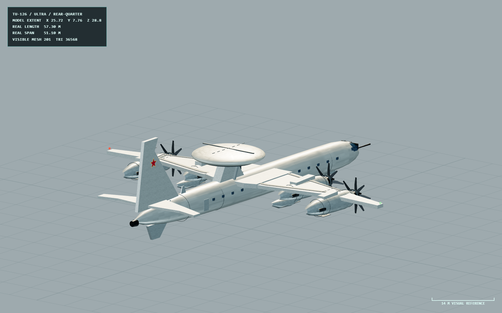

# Tu-126 Moss

> Data snapshot: v1.15.0 · 2026-07-29

苏联 AEW 平台，使用苏联 GCI/目标指示语义，不接入 NATO Link 16。其作用是改善态势和齐射协调，不自动授予导弹发射权限。源码：`src/air/aew/`。

## v1.15.0 Ultra 模型截图

*v1.15.0 Ultra 资产验收视图：展示 Tu-114 衍生机体、Liana 雷达罩、加油探管与四组 NK-12 同轴反转螺旋桨。*

## v1.15.0 程序化模型

模型按 57.3 米总长（含加油探管）、51.1 米翼展和 11 米 Liana 雷达罩直径的参考关系构建，统一采用 2 米/单位视觉尺度与独立 Ultra/High/Low 几何。外形包含 Tu-114 衍生后掠翼、加油探管、腹鳍、雷达罩支架和后期尾部 ECM 整流罩。

四台 NK-12 每台包含两组反向旋转的四叶螺旋桨，共八片叶片的同轴桨视觉结构。三档各自拥有动画对象；验证检查大尺度外形、雷达罩尺寸、四台发动机、反转方向和几何独立性。模型验证不替代 Liana 扫描、voice-GCI 延迟、航迹质量或毁伤回归。

## 与 E-2C 的区别

Tu-126 的空情经过苏联 GCI/指挥链分发，网络延迟、容量和行为条令与 NATO Link 11/16 分开建模。它可提示 Tu-16K 或战斗机搜索方向并改善拦截/齐射计划，但不会把西方协同交战语义复制给苏联侧。平台被压制或丢失后，编队应退回本机传感器和已有航迹记忆。

## 游戏参数

| 类别 | 数值 |
|---|---|
| RCS / 红外特征 | 145 / 1.8 |
| 巡航 / 最大 / 失速速度 | 3.9 / 5.85 / 1.75 |
| 最大过载 / 滚转 / 俯仰 | 2.5 g / 24°/s / 7°/s |
| 燃油 / 气动质量 / 翼面积 | 2600 s / 150000 kg / 311 m² |
| 雷达 | Liana，旋转 360°，距离 795，刷新 7.2 s，精度 0.62 |
| 截击控制 | voice-GCI；容量 1，延迟 4.5 s，寿命 16 s，可靠性 0.78；控制 MiG-29A |
| ECM / 诱饵 | 0.58 / 烧穿 42；箔条 30，热焰弹 8 |

## 运行时与证据

Tu-126 没有 NATO 数据链终端、挂载或武器通道。voice-GCI 的容量更低、延迟更长、精度更差；MiG-29A 仍须按提示区域用 N019 建立有机航迹。平台是可击毁实体，发动机、雷达、飞控和结构损伤进入任务 AI。AAR/ACMI 保留控制航迹、指令、延迟、目标飞机、失效时间和平台毁伤，而不是只在 HUD 显示“AEW ON”。

源码：`src/air/aew/catalog.ts`、`src/air/aew/runtime.ts`、`src/soviet-c2/`、`src/air/aew/model-assets/tu126.ts`。
