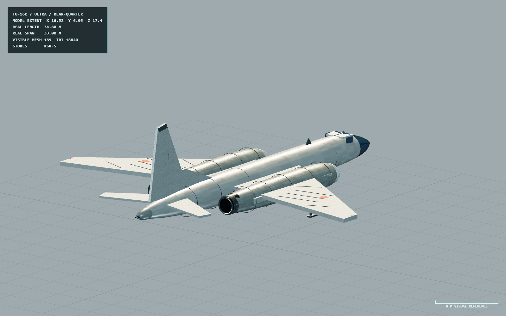

# Tu-16K Badger-G

> v1.15.0 · 2026-07-29 | [Platforms](README.md) | [中文](../../PLATFORMS/TU16K_BADGER_G.md)

Soviet maritime-strike bomber with Rubin-1K radar and one KSR-5 assigned to a compatible under-wing anchor. Game values: cruise/max speed 4.2/5.4, 2.5 g, 1300 fuel-seconds, RCS 28, ECM strength 0.68, and 48-unit burn-through range.

It follows approach and release orders, launches through its physical hardpoint, then turns away. Defensive maneuver is deliberately limited by bomber aerodynamics; it may use ECM, chaff, and flares but has no Link 16 or fighter-style afterburner.

## v1.15.0 Ultra asset view

*V1.15 Ultra acceptance view showing the faceted glazed nose, swept wing, integrated root nacelles, tail guns, and under-wing KSR-5 carriage.*

## v1.15.0 procedural asset

The model uses the 34.8 m length and 33 m span relationship on the common 2 m/unit visual scale, with independently built Ultra, High, and Low geometry. The rebuild includes the faceted glazed nose, strongly swept wing, integrated wing-root engine nacelles, aft radar fairing, twin-gun tail turret, and heavy under-wing KSR carrier beams.

The platform owns one KSR-5. Two wing anchors are compatible, but runtime inventory can populate only a concrete station and release from that station. Asset checks cover the bomber/fighter relative scale, attachment position, and KSR clearance; the KSR flight envelope, terminal search, and ECM remain runtime-test concerns.

## Game definition

| Field | Value |
|---|---|
| RCS / IR signature | 28 / 1.35 |
| Cruise / max / stall speed | 4.2 / 5.4 / 1.8 |
| Load / roll / pitch limits | 2.5 g / 38 deg/s / 10 deg/s |
| Fuel / mass / wing area | 1300 s / 76,000 kg / 164.7 m² |
| Radar | Rubin-1K: range 600, 1.5 s refresh, 100° FOV, 0.70 precision |
| ECM / burn-through | 0.68 / 48 |
| Countermeasures | 42 chaff, 18 flares, 4+2 bursts, 4.5 s cooldown |
| Store | One KSR-5 assigned to one of two compatible wing anchors; 0.65 s release and 0.8 s ignition delay |

The platform receives Soviet GCI/maritime/fleet cues, never Link 16. Cue delivery does not authorize launch. Its 13° critical AoA, 1.4 s control response, and 7.2 s engine spool prevent fighter-like defensive turns. AAR preserves command, salvo, release-owner, missile, and damage evidence.

Model source: `src/air/model-assets/soviet/tu16k.ts`.
